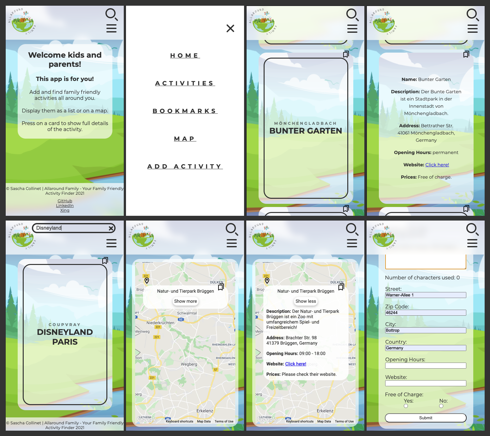

# Allaround Family

Your Family Friendly Activity Finder

## A helpful tool to find family friendly activities

Add, find & display activities for the whole family all around you.

### Add new activities

Add new activities for everyone else, so they don't miss out on the fun.

### Display them on a map

Enjoy exploring what's near your home, or plan your next holiday by checking the location in advance.

### Boomark them

Bookmark favorite activities, or the once you want to try in the future and quickly find them on an additional page.

## Screenshot

## Demo

[View Live Demo](http://capstone-project-rosy.vercel.app/)

## Tech-Stack

`React`,
`React-Router`,
`Styled-Components`,
`React-Hooks`,
`localStorage`,
`Google-Map-React`,
`React-Testing-Library`,
`Storybook`,
`Vercel`,
`npm`,
`Git Workflow`,
`Figma`,
`Scrum`

## Install project

- clone Project
- run `npm i` to install all necessary dependencies
- add `.env` file with a working Google Maps API key, to make the map work properly
- run `npm start` to run the project locally
- press `control + c` inside the terminal to stop the localhost

## © Copyright

Copyright Sascha Collinet 2021
